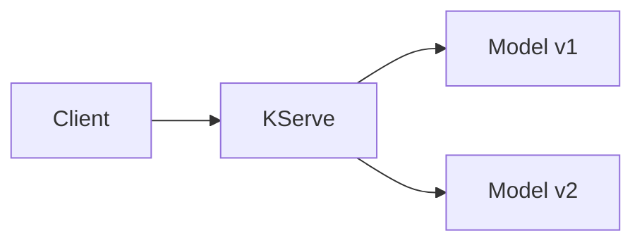

# KServe Demo Guide

## Project Overview

This demo showcases how to:
- Deploy machine learning models using KServe
- Implement model versioning
- Set up autoscaling for ML workloads
- Configure canary deployments
- Add authentication to model endpoints

## Architecture



## Prerequisites

- Docker account and CLI installed
- Python 3.7+ with pip
- kubectl CLI tool
- kind (Kubernetes in Docker)

## Running the Demo

### 1. Environment Setup
```bash
cd path/to/kserve-demo
./scripts/setup_kserve.sh

# Verify installation
kubectl get pods -A
```
### KServe Component Analysis

#### Core Infrastructure (kube-system namespace)
- Control plane components (apiserver, controller, scheduler)
- CoreDNS for service discovery
- Network plugins

#### KServe Stack Components

**Istio (istio-system)**
- Service mesh for networking
- Handles traffic routing and load balancing
- Required for KServe's networking capabilities

**Knative (knative-serving)**
- Serverless platform components
- Handles auto-scaling
- Manages revisions and traffic splitting

**KServe (kserve)**
- Model serving controller
- Handles model deployment and lifecycle

#### Supporting Services
- Cert Manager: Handles SSL/TLS certificates
- Prometheus/Grafana: Monitoring and metrics
- Local Path Provisioner: Storage management

### 2. Model Training
```bash
# Create and activate virtual environment
python -m venv .venv
source .venv/bin/activate  # For Unix/macOS
# Or
.\.venv\Scripts\activate  # For Windows

# Install requirements
pip install -r models/requirements.txt
```
```bash
# Install dependencies
pip install scikit-learn pandas numpy joblib

# Train models
> python models/train_model_v1.py
expected output: Model saved to 'sentiment-model-v1/model.joblib'
> python models/train_model_v2.py
expected output: Improved model saved to 'sentiment-model-v2/model.joblib'
```

### 3. Docker Image Build & Push

```bash
export DOCKER_USERNAME=your-username

# Build images
docker build -t $DOCKER_USERNAME/sentiment-model:v1 -f docker/Dockerfile.v1 .
docker build -t $DOCKER_USERNAME/sentiment-model:v2 -f docker/Dockerfile.v2 .

# Push to registry
docker login
docker push $DOCKER_USERNAME/sentiment-model:v1
docker push $DOCKER_USERNAME/sentiment-model:v2
```

### 4. Model Deployment
```bash
# Update and apply deployment
sed -i '' "s/\${DOCKER_USERNAME}/$DOCKER_USERNAME/g" kubernetes/kserve_deployment.yaml
kubectl apply -f kubernetes/kserve_deployment.yaml

# Wait for the service to be ready
kubectl wait --for=condition=ready inferenceservice sentiment-classifier --timeout=300s

# Get service hostname and test deployment
SERVICE_HOSTNAME=$(kubectl get inferenceservice sentiment-classifier -o jsonpath='{.status.url}' | cut -d "/" -f 3)

if [ -z "$SERVICE_HOSTNAME" ]; then
    echo "Error: Could not get service hostname"
    echo "Checking service status..."
    kubectl describe inferenceservice sentiment-classifier
    exit 1
fi

echo "Service hostname: $SERVICE_HOSTNAME"

# ⚠️ Set up port forwarding (run in a separate terminal)
kubectl port-forward $(kubectl get pods -l serving.kserve.io/inferenceservice=sentiment-classifier -o jsonpath='{.items[0].metadata.name}') 8080:8080

# Test the model using localhost
python scripts/test_model.py --hostname localhost --port 8080

```

### 5. Advanced Features

**Autoscaling:**

Step 5: Demonstrate Autoscaling

#### Testing Autoscaling

1. Apply autoscaling configuration:
```bash
sed -i '' "s/\${DOCKER_USERNAME}/$DOCKER_USERNAME/g" kubernetes/kserve_autoscaling.yaml
kubectl apply -f kubernetes/kserve_autoscaling.yaml
```
2. Set up continuous port forwarding (in a separate terminal) ⚠️:
```bash
# This script will automatically reconnect if the pod changes
while true; do
    POD_NAME=$(kubectl get pods -l serving.kserve.io/inferenceservice=sentiment-classifier -o jsonpath='{.items[0].metadata.name}')
    if [ ! -z "$POD_NAME" ]; then
        echo "Forwarding port for pod: $POD_NAME"
        kubectl port-forward $POD_NAME 8080:8080 || true
        sleep 2
    else
        echo "Waiting for pod to be available..."
        sleep 5
    fi
done
```

3. Watch pod scaling (in a new terminal) ⚠️:
```bash
kubectl get pods -w
```

4. Generate load to trigger autoscaling:
```bash
# Start with a smaller load first
python scripts/load_generator.py --hostname localhost --port 8080 --requests 100 --concurrency 5

# Then increase load to trigger scaling
python scripts/load_generator.py --hostname localhost --port 8080 --requests 1000 --concurrency 20
```

You should see new pods being created automatically as the load increases.

**Canary Deployment:**

1. Apply canary configuration:
```bash
# Update and apply canary deployment
sed -i '' "s/\${DOCKER_USERNAME}/$DOCKER_USERNAME/g" kubernetes/kserve_canary.yaml
kubectl apply -f kubernetes/kserve_canary.yaml

# Check service status
kubectl get inferenceservice sentiment-classifier

# Monitor traffic distribution
kubectl get isvc sentiment-classifier -o yaml | grep -A 5 status
```

2. Set up port forwarding for testing (in a separate terminal) ⚠️:
```bash
kubectl port-forward $(kubectl get pods -l serving.kserve.io/inferenceservice=sentiment-classifier -o jsonpath='{.items[0].metadata.name}') 8080:8080
```

3. Test the canary deployment:
```bash
# Run tests against both versions
python scripts/test_model.py --hostname localhost --port 8080
```

### 6. Authentication

1. Apply the authentication configuration:
```bash
# First, remove any existing secret
kubectl delete secret model-auth-secret --ignore-not-found

# Apply auth configuration
kubectl apply -f kubernetes/kserve_auth.yaml

# Verify secret creation
kubectl get secret model-auth-secret
```

2. Wait for the authenticated service to be ready:
```bash
# Check service status
kubectl wait --for=condition=ready inferenceservice sentiment-classifier-auth --timeout=300s

# View service details
kubectl get inferenceservice sentiment-classifier-auth
```

3. Set up port forwarding (in a separate terminal):
```bash
# Get pod name and set up port forwarding
kubectl port-forward $(kubectl get pods -l serving.kserve.io/inferenceservice=sentiment-classifier-auth -o jsonpath='{.items[0].metadata.name}') 8080:8080
```

4. Test the authenticated endpoint:
```bash
# Test with authentication
python scripts/test_model.py --hostname localhost --port 8080 --auth --username admin --password kserve-demo

# Test without authentication (should fail)
python scripts/test_model.py --hostname localhost --port 8080
```

5. Test with load generator (optional):
```bash
# Generate load with authentication
python scripts/load_generator.py --hostname localhost --port 8080 --requests 100 --concurrency 10 --auth --username admin --password kserve-demo
```

Expected Results:
- Authenticated requests should return predictions with 200 status code
- Unauthenticated requests should fail with 401 Unauthorized
- You should see authentication headers in the pod logs

## Cleanup
```bash
kind delete cluster --name kserve-demo
```

## FAQ

### Empty Service Hostname
If `kubectl get inferenceservice` returns no output:
1. Verify deployment: `kubectl get pods -A`
2. Check service status: `kubectl describe inferenceservice sentiment-classifier`
3. Review events: `kubectl get events --sort-by='.lastTimestamp'`

### Finding Docker Username
Options to find your Docker username:
1. Check config: `cat ~/.docker/config.json`
2. View login status: `docker login`
3. Check environment: `echo $DOCKER_USERNAME`
4. Login to hub.docker.com

### Common Issues
- ImagePullBackOff: Check image accessibility
- Service issues: Use `kubectl describe inferenceservice`
- Network problems: Verify Istio setup
- Pod failures: Check logs with `kubectl logs <pod-name>`

# Clean up any existing resources
```bash
# Delete all inference services and related namespaces
kubectl delete inferenceservice --all
kubectl delete namespace kserve --ignore-not-found
kubectl delete namespace knative-serving --ignore-not-found

# Verify deletion
kubectl get inferenceservice --all-namespaces
kubectl get namespace kserve
kubectl get namespace knative-serving
```

### What to Expect

Throughout this demo, you'll observe:

- **Basic Deployment**
    - Model deployment and readiness for predictions
    
- **Autoscaling**
    - Automatic pod creation as load increases
    
- **Canary Deployment**
    - Traffic splitting between model versions
    - Safe rollout capabilities
    
- **Authentication**
    - Model endpoint security with basic auth

Each step demonstrates key KServe capabilities essential for production ML deployments on Kubernetes.

### Troubleshooting Tips

| Issue | Resolution |
|-------|------------|
| ImagePullBackOff errors | Verify Docker images are pushed and public |
| InferenceService not ready | Use `kubectl describe inferenceservice sentiment-classifier` |
| Networking issues | Check Istio with `kubectl get gateway -A` and `kubectl get virtualservice -A` |
| Pod errors | Investigate with `kubectl logs <pod-name>` |

### Understanding Canary Deployments

When running the canary deployment, you should expect to see:

1. Version Distribution
```bash
# Check both versions running
kubectl get pods -l serving.kserve.io/inferenceservice=sentiment-classifier --show-labels
```
Expected output:
```
NAME                                                              READY   STATUS    LABELS
sentiment-classifier-predictor-default-00001-deployment-7f...     2/2     Running   version=v1
sentiment-classifier-predictor-canary-00001-deployment-9d...      2/2     Running   version=v2
```

2. Monitor Traffic Split
```bash
# View real-time traffic distribution
watch kubectl get isvc sentiment-classifier
```
Expected output:
```
NAME                   URL                                        READY   PREV   LATEST   PREVROLLEDOUT   LATESTREADY
sentiment-classifier   http://sentiment-classifier.default.svc    True    80%    20%      True           True
```

3. Test Traffic Distribution
```bash
# Run multiple requests to see distribution
for i in {1..10}; do
    python scripts/test_model.py --hostname localhost --port 8080
    sleep 1
done
```

4. Verify Responses
- V1 Model: Returns basic sentiment (0 or 1)
- V2 Model: Returns sentiment with confidence scores
Example V2 response:
```json
{
  "predictions": [
    {"sentiment": 1, "confidence": 0.92},
    {"sentiment": 0, "confidence": 0.85}
  ]
}
```

5. Monitor Metrics
```bash
# View request metrics
kubectl get --raw /apis/custom.metrics.k8s.io/v1beta1/namespaces/default/pods/*/prediction_requests | jq .
```

Common Issues:
- If traffic split isn't visible, check: `kubectl describe isvc sentiment-classifier`
- For pod status issues: `kubectl get pods -w`
- For traffic routing problems: `kubectl -n istio-system get virtualservices`