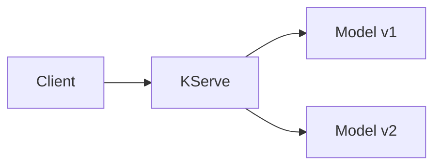

# KServe Demo Guide

## Project Overview

This demo showcases how to:
- Deploy machine learning models using KServe
- Implement model versioning
- Set up autoscaling for ML workloads
- Configure canary deployments
- Add authentication to model endpoints

## Architecture



## Prerequisites

- Docker account and CLI installed
- Python 3.7+ with pip
- kubectl CLI tool
- kind (Kubernetes in Docker)

## Running the Demo

### 1. Environment Setup
```bash
cd path/to/kserve-demo
./scripts/setup_cluster.sh

# Verify installation
kubectl get pods -A
```

### 2. Model Training
```bash
# Install dependencies
pip install scikit-learn pandas numpy joblib

# Train models
python models/train_model_v1.py
python models/train_model_v2.py
```

### 3. Docker Image Build & Push
```bash
export DOCKER_USERNAME=your-username

# Build images
docker build -t $DOCKER_USERNAME/sentiment-model:v1 -f docker/Dockerfile.v1 .
docker build -t $DOCKER_USERNAME/sentiment-model:v2 -f docker/Dockerfile.v2 .

# Push to registry
docker login
docker push $DOCKER_USERNAME/sentiment-model:v1
docker push $DOCKER_USERNAME/sentiment-model:v2
```

### 4. Model Deployment
```bash
# Update and apply deployment
sed -i '' "s/\${DOCKER_USERNAME}/$DOCKER_USERNAME/g" kubernetes/kserve_deployment.yaml
kubectl apply -f kubernetes/kserve_deployment.yaml

# Test deployment 
export SERVICE_HOSTNAME=$(kubectl get inferenceservice sentiment-classifier -o jsonpath='{.status.url}' | cut -d "/" -f 3)
python scripts/test_model.py --hostname $SERVICE_HOSTNAME
```

### 5. Advanced Features

**Autoscaling:**
```bash
kubectl apply -f kubernetes/kserve_autoscaling.yaml
python scripts/load_generator.py --hostname $SERVICE_HOSTNAME --requests 1000 --concurrency 20
```

**Canary Deployment:**
```bash
kubectl apply -f kubernetes/kserve_canary.yaml
```

**Authentication:**
```bash
kubectl apply -f kubernetes/kserve_auth.yaml
```

## Cleanup
```bash
kind delete cluster --name kserve-demo
```

## FAQ

### Empty Service Hostname
If `kubectl get inferenceservice` returns no output:
1. Verify deployment: `kubectl get pods -A`
2. Check service status: `kubectl describe inferenceservice sentiment-classifier`
3. Review events: `kubectl get events --sort-by='.lastTimestamp'`

### Finding Docker Username
Options to find your Docker username:
1. Check config: `cat ~/.docker/config.json`
2. View login status: `docker login`
3. Check environment: `echo $DOCKER_USERNAME`
4. Login to hub.docker.com

### Common Issues
- ImagePullBackOff: Check image accessibility
- Service issues: Use `kubectl describe inferenceservice`
- Network problems: Verify Istio setup
- Pod failures: Check logs with `kubectl logs <pod-name>`

# Clean up any existing resources
kubectl delete inferenceservice --all
kubectl delete namespace kserve --ignore-not-found
kubectl delete namespace knative-serving --ignore-not-found
